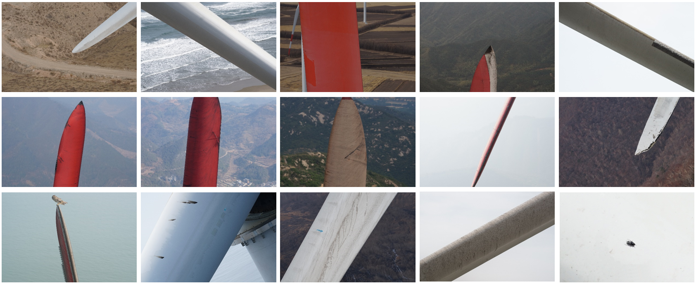

# Blade30

Blade30 is a comprehensive dataset for multiple blade-related tasks, including blade stitching, segmentation, defect detection, classification and deduplication, contamination detection and classification, and more. Blade30 was collected during the real drone-based wind turbine inspection in various environments. It contains 1,302 real drone-captured images covering 30 full blades captured under various conditions (both on- and off-shore), accompanied by a rich set of annotations such as defects and contaminations, etc. Thus, Blade30 leads in both quality and quantity. 

paper: https://www.sciencedirect.com/science/article/pii/S0960148122018481?via%3Dihub=

## Download
1. Baidu Disc: 
    - part1 (blade1-15): https://pan.baidu.com/s/17kv5Xadz1QcSrvoG58WtBw code：1234
    - part2 (blade16-30): https://pan.baidu.com/s/1hzcwdc6sBXOeja3nkfartg  code：1234
2. OneDrive: 
    - full dataset: https://1drv.ms/u/s!AoXJBmXKVWu5tmtUzCJULhrtYuIP?e=KYOtlo

## Citation

If you use these works in your research, please cite:

	@article{Yang2023Blade30,
		author = {Cong Yang and Xun Liu and Hua Zhou and Yan Ke and John See},
		title = {Towards accurate image stitching for drone-based wind turbine blade inspection},
		journal = {Renewable Energy},
            volume={203},
            pages={267-279},
            year={2023},
	}

**Data Structure**:

- Blade_1
   - mask: ground truth of blade region segmentation
      - 10_d78543cb-5fb1-4677-b92e-2ece550642c9.jpg: blade image
      - 10_d78543cb-5fb1-4677-b92e-2ece550642c9.json: ground truth of defects and contaminations
        - label: label name
	- points: bounding boxes

